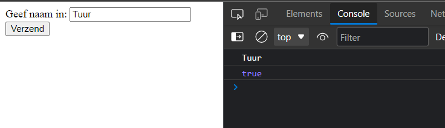
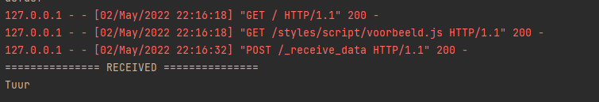
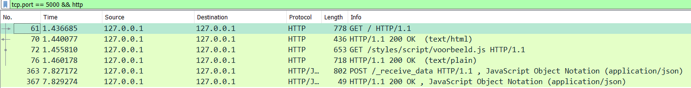

=== Data Verzenden

Hier is een voorbeeld hoe je ziet hoe je van javascript naar python kunt communiceren.

Dit is de html code het programma, dat om een naam vraagt.

[source, html]
----
<body>
    <label for="">Geef naam in:</label>
    <input type="text" name="" id="naam">
    <button id="btn">Verzend</button>
</body>
----

Dit is het javascript gedeelte, zodra er op de button (id="btn") wordt gedrukt word de naam
naar python verzonden.
[source, javascript]
----
const setup = () => {
    // Hier wordt de input en de button opgehaald van uit de html pagina.
    let name = document.getElementById("naam")
    let btn = document.getElementById("btn")

    // Hier voegen we een event aan toe die er voor zorgt dat zodra
    // er op de button gedrukt word iets gebeurt.
    btn.addEventListener("click", e =>{
        console.log(name.value)

        // Hier versturen we de data door naar python
        $.ajax({
            type: "POST",
            url: "/_receive_data",
            data: JSON.stringify(name.value),
            contentType: "application/json",
            dataType: 'json',
            success: function (response) {
                console.log(response)
                if(!response){
                    alert("Naam moet in hoofd letter zijn.")
                }
            }
        });
    })
}

window.addEventListener("load", setup);
----

Dit is het python gedeelte.
Zodra er op de button wordt gedrukt gaat de event listener in javascript in actie.
Die zal dan data verzenden naar deze url */_recieve_data* .

[source, python]
----
@index.route("/_receive_data", methods=['GET', "POST"])
def _receive_data():
    data = request.get_json()
    print("=============== RECEIVED ===============")
    print(data)
    # Als begin letter hoofdletter is.
    if data[0].isupper():
        return jsonify(True)
    else:
        return jsonify(False)
----

Als alles goed is verzend python dan een boolean terug True voor goed aangekomen False voor niet.
Hier is de output van javascript.

Hier is de output van python.

== Wat gebeurt er achter de schermen ?

Op de eerste lijn wordt een *request* gemaakt. die vraagt de html pagina op.
[source]
--
61	1.436685	127.0.0.1	127.0.0.1	HTTP	778	GET / HTTP/1.1
--

Hier wordt een *response* terug gegeven (de html pagina).
[source]
--
70	1.440077	127.0.0.1	127.0.0.1	HTTP	436	HTTP/1.1 200 OK  (text/html)
--

In de html pagina staat een link die verwijst naar een javascipt bestand (voorbeeld.js)
Die wordt ook opgevraagt met een *request*.
[source]
--
72	1.455810	127.0.0.1	127.0.0.1	HTTP	653	GET /styles/script/voorbeeld.js HTTP/1.1
--

Hier wordt die ook terug gegeven
[source]
--
76	1.460178	127.0.0.1	127.0.0.1	HTTP	718	HTTP/1.1 200 OK  (text/plain)
--

Nu is de volledige pagina geladen en klaar voor gebruik.
Als er nu op de knop wordt gedrukt wordt er een *request* gemaakt naar python.
[source]
--
363	7.827172	127.0.0.1	127.0.0.1	HTTP/JSON	802	POST /_receive_data HTTP/1.1 , JavaScript Object Notation (application/json)
--

Als alles goed gaat stuurt python dan een *response* terug.
[source]
--
367	7.829274	127.0.0.1	127.0.0.1	HTTP/JSON	49	HTTP/1.1 200 OK , JavaScript Object Notation (application/json)
--

== Oefening

Zorg er voor dat de gebruiker nu 2 dingen kan ingeven.

- naam
- leeftijd

Als de gebruiker op de button drukt moet de data verzonden worden via javascript naar
python. Geef een een gepaste response terug.

Valideer de data in python:

- naam moet met hoofdletter beginnen
- leeftijd moet minimum 12 en max 99 jaar zijn.

